# Agentic Research System - Deployment Guide

This project is fully Dockerized for easy deployment on a VPS or local machine.

## Agentic Workflow Architecture

The system uses a **LangGraph-based multi-agent pipeline** to research, analyze, and generate content:

```mermaid
flowchart LR
    subgraph Input
        T["🔍 Topic"]
    end

    subgraph Agents["Multi-Agent Pipeline"]
        R["🧑‍🔬 Researcher<br/><i>Gemini Flash</i>"]
        W["✍️ Writer<br/><i>Gemini Flash</i>"]
        S["🤨 Skeptic<br/><i>Gemini Flash</i>"]
        H["🚀 Hype<br/><i>Gemini Flash</i>"]
    end

    subgraph Output
        E["📝 Final Post<br/>+ Critiques"]
    end

    T --> R
    R -->|"Research Brief"| W
    W -->|"Draft Post"| S
    S -->|"Add Critique"| H
    H --> E

    style R fill:#4CAF50,color:#fff
    style W fill:#2196F3,color:#fff
    style S fill:#FF9800,color:#fff
    style H fill:#E91E63,color:#fff
```



### Agent Roles

| Agent | Role | Output |
|-------|------|--------|
| **Researcher** | Searches web, scrapes content, synthesizes technical briefing | `research_brief` |
| **Writer** | Drafts structured forum post with tl;dr and citations | `messages` |
| **Skeptic** | Critiques methodology, identifies hype and limitations | `critiques[]` |
| **Hype** | Extrapolates future possibilities and startup ideas | `critiques[]` |

## Prerequisites
1.  **Docker & Docker Compose** installed.
2.  **Supabase Project** (Free Tier).
3.  **Google AI Studio API Key** (Gemini).

## 1. Environment Setup

Create a `.env` file in the root directory on your VPS.

**Required Variables**:
```bash
SUPABASE_URL=https://your-project.supabase.co
SUPABASE_ANON_KEY=your-anon-key                 # For Frontend (Public)
SUPABASE_SERVICE_ROLE_KEY=your-service-role-key # For Backend (Private/Admin)
GOOGLE_API_KEY=your-gemini-key
# Note: NEXT_PUBLIC_API_URL is NO LONGER NEEDED (Handled via internal proxy)
API_URL=http://backend:8000/research            # Internal network URL for Ingestion service
```

## 2. Database Initialization (One-Time)
Run the following SQL in your **Supabase Dashboard > SQL Editor** to create the tables and functions.
*See `supabase_schema.sql` for the full script.*

## 3. Deploying with Docker
Run the following command in the root directory:

```bash
docker-compose up --build -d
```

### Architecture (Secure):
*   **Frontend (Port 3001)**: Accessible to the public. It proxies API requests safely to the backend.
*   **Backend (Internal)**: Not exposed to the internet. Only accessible via the Frontend or Ingestion service.
*   **Ingestion Service**: Runs internally.

## Troubleshooting
*   **Frontend can't connect**: Ensure `docker-compose` is running. Configuration is now automatic via Docker networking.
