# Agentic Research System - Deployment Guide

This project is fully Dockerized for easy deployment on a VPS or local machine.

## Agentic Workflow Architecture

The system uses a **LangGraph-based multi-agent workflow** with feedback loops, conditional routing, multi-turn debate, and self-reflection:

```mermaid
flowchart TB
    subgraph Research["🔬 Research Phase"]
        T["🔍 Topic"] --> R["🧑‍🔬 Researcher"]
        R --> SR["🔍 Self-Reflect"]
        SR -->|"score < 6"| R
    end

    subgraph Writing["✍️ Writing Phase"]
        SR -->|"score ≥ 6"| W["✍️ Writer"]
        W --> C["📝 Critic"]
        C -->|"needs revision"| W
    end

    subgraph Debate["💬 Multi-Turn Debate (2 rounds)"]
        C -->|"approved"| DS["🤨 Skeptic"]
        DS --> DH["🚀 Hype"]
        DH -->|"round < 2"| DS
    end

    DH -->|"round = 2"| SYN["🔄 Synthesizer"]
    SYN --> E["📝 Final Post + Critiques"]

    style R fill:#4CAF50,color:#fff
    style SR fill:#9C27B0,color:#fff
    style W fill:#2196F3,color:#fff
    style C fill:#607D8B,color:#fff
    style DS fill:#FF9800,color:#fff
    style DH fill:#E91E63,color:#fff
    style SYN fill:#00BCD4,color:#fff
```



### Agent Roles

| Agent | Role | Output |
|-------|------|--------|
| **Researcher** | Web search, scraping, synthesizes technical brief | `research_brief` |
| **Self-Reflect** | Rates research quality (1-10), requests revision if < 6 | `quality_score` |
| **Writer** | Drafts forum post with tl;dr & citations | `draft_post` |
| **Critic** | Reviews draft, can request up to 2 revisions | `reflection_feedback` |
| **Skeptic** | Critiques methodology, counters hype | `debate_history` |
| **Hype** | Extrapolates possibilities, counters skepticism | `debate_history` |
| **Synthesizer** | Combines 2-round debate into final output | `critiques[]` |

## Prerequisites
1.  **Docker & Docker Compose** installed.
2.  **Supabase Project** (Free Tier).
3.  **Google AI Studio API Key** (Gemini).

## 1. Environment Setup

Create a `.env` file in the root directory on your VPS.

**Required Variables**:
```bash
SUPABASE_URL=https://your-project.supabase.co
SUPABASE_SECRET_KEY=xxx # For Backend (Private/Admin)
NEXT_PUBLIC_SUPABASE_PUBLISHABLE_KEY=xxx # For Frontend (Public)
GOOGLE_API_KEY=your-gemini-key
API_URL=http://backend:8000/research            # Internal network URL for Ingestion service
```

## 2. Database Initialization (One-Time)
Run the following SQL in your **Supabase Dashboard > SQL Editor** to create the tables and functions.
*See `supabase_schema.sql` for the full script.*

## 3. Deploying with Docker
Run the following command in the root directory:

```bash
docker-compose up --build -d
```

### Architecture (Secure):
*   **Frontend (Port 3001)**: Accessible to the public. It proxies API requests safely to the backend.
*   **Backend (Internal)**: Not exposed to the internet. Only accessible via the Frontend or Ingestion service.
*   **Ingestion Service**: Runs internally.

## Troubleshooting
*   **Frontend can't connect**: Ensure `docker-compose` is running. Configuration is now automatic via Docker networking.
